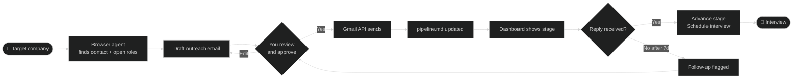

# Job Copilot

An AI-assisted job search framework built for senior engineers. Seed it with target companies, and it handles outreach, tracking, follow-up, and dashboarding — so you spend your time preparing for interviews, not managing a spreadsheet.

---

## How it works



## What this is

Job searching at senior/staff level is a full-time job: tracking 20+ companies, writing personalised outreach, following up at the right time, keeping notes on every conversation. This project automates the mechanical parts using AI so you can focus on the parts that actually matter — preparation and conversation.

**The core loop:**

```
You add a target company
  → Copilot finds the right contact and drafts an outreach email
  → You review and send (one command)
  → Pipeline tracker updates automatically
  → Follow-up is flagged if no reply after N days
  → Dashboard shows your full pipeline at a glance
```

---

## Dashboard preview

Open [`dashboard/demo.html`](dashboard/demo.html) in your browser to see a live demo with sample data — no setup needed.

## What's working today (v0.1)

| Feature | Status | Details |
|---------|--------|---------|
| Browser agent | ✅ | Navigates any careers page, finds contacts, extracts job details |
| Gmail outreach | ✅ | Sends via your Gmail account (OAuth2, no password stored) |
| Pipeline tracker | ✅ | `pipeline.md` — one row per company, plain markdown |
| Health monitoring | ✅ | Checks Gmail token validity and automation health every 2h |
| Dashboard | ✅ | HTML file, opens locally — visual pipeline by stage |
| Background automation | ✅ | LaunchAgent (macOS) / systemd (Linux) for periodic checks |
| Interview debrief | ✅ | Reads meeting transcripts, creates structured debrief notes, updates pipeline |
| Prep notes + cheat sheets | ✅ | Per-company prep folders, topic cheat sheets, gap tracker |

## Planned

| Feature | Target |
|---------|--------|
| Auto job discovery | v0.2 — periodic scan of target company career pages |
| Follow-up automation | v0.2 — flag stale outreach, draft follow-ups |
| Standalone prep module | v0.3 — extract from Obsidian vault into portable format |
| Cloud deployment | v0.3 — Dockerfile + setup guide, run on a €4/mo VPS |
| Application assist | v0.3 — navigate to job application, hand off to Simplify/autofill |

---

## Architecture

```
job-copilot/
├── agents/
│   └── browser_agent.py     # AI browser automation (browser-use + local/cloud LLM)
├── tools/
│   ├── send_email.py        # Gmail API sender (OAuth2)
│   └── health_check.py      # Monitors token validity and automation health
├── dashboard/
│   └── index.html           # Visual pipeline dashboard (open as local file)
├── automation/
│   ├── com.jobcopilot.health.plist   # macOS LaunchAgent (runs health_check every 2h)
│   └── job-copilot-health.service   # Linux systemd service
├── pipeline.md              # Your opportunity tracker (edit this directly)
├── requirements.txt
└── setup.sh                 # One-command setup
```

**LLM layer:** The browser agent works with any OpenAI-compatible endpoint. Run it with a local model (LM Studio, Ollama) for zero ongoing cost, or point it at OpenAI/Anthropic for speed and accuracy. Qwen3 27B works well locally for navigation tasks.

**Email layer:** OAuth2 via Gmail API. Credentials stay on your machine, never in the repo. The send script requires you to see and approve the full draft before anything goes out.

**Pipeline layer:** Plain markdown. No database, no sync, no lock-in. `pipeline.md` is the source of truth — edit it directly, or let the scripts update it.

---

## Quickstart

### 1. Clone and install

```bash
git clone https://github.com/ankitdixit/job-copilot
cd job-copilot
python3 -m venv .venv && source .venv/bin/activate
pip install -r requirements.txt
playwright install chromium
```

### 2. Configure

Copy the example config and fill in your details:

```bash
cp .env.example .env
```

Edit `.env`:

```bash
# Your email address
GMAIL_USER=you@gmail.com

# LLM — local (LM Studio) or cloud (OpenAI)
LLM_BASE_URL=http://localhost:1234/v1
LLM_MODEL=qwen3-27b
LLM_API_KEY=lm-studio
```

### 3. Gmail setup (one-time)

You need a Google Cloud project to send email via Gmail API.

1. Go to [console.cloud.google.com](https://console.cloud.google.com)
2. Create a project → Enable **Gmail API**
3. Go to **Credentials** → **Create Credentials** → **OAuth 2.0 Client ID** → Desktop app
4. Download the JSON → save as `~/.config/job-copilot/credentials.json`
5. Run the auth flow once:
   ```bash
   python3 tools/send_email.py --to you@gmail.com --subject "test" --body "hello"
   ```
   A browser window opens → click Allow → token saved to `~/.config/job-copilot/token_send.json`

After this, email sending works silently from the command line.

### 4. Set up background monitoring (optional)

**macOS:**
```bash
cp automation/com.jobcopilot.health.plist ~/Library/LaunchAgents/
sed -i '' "s|/path/to/job-copilot|$(pwd)|g" ~/Library/LaunchAgents/com.jobcopilot.health.plist
launchctl load ~/Library/LaunchAgents/com.jobcopilot.health.plist
```

**Linux (systemd):**
```bash
cp automation/job-copilot-health.service ~/.config/systemd/user/
sed -i "s|/path/to/job-copilot|$(pwd)|g" ~/.config/systemd/user/job-copilot-health.service
systemctl --user enable --now job-copilot-health.service
```

---

## Usage

### Find open roles at a target company

```bash
source .venv/bin/activate
python3 agents/browser_agent.py "go to mistral.ai/careers and list all open engineering roles with titles and links"
```

### Draft and send outreach

Always review before sending. Never sends automatically.

```bash
# Draft your email in a file
cat > /tmp/outreach.txt << 'EOF'
Hi [Name],

I came across [Company] and was impressed by [specific thing].
I'm a Staff Engineer with a background in [X, Y, Z] and I'm exploring
opportunities in AI infrastructure. Would you have 20 minutes for a
quick call?

[Your name]
EOF

# Preview and send
python3 tools/send_email.py \
  --to name@company.com \
  --subject "Staff Engineer — interested in [Company]" \
  --body-file /tmp/outreach.txt
```

### View dashboard

Open `dashboard/index.html` in your browser. It reads from `pipeline.md` and shows stage, last action, and days since contact for each company.

### Update your pipeline

Edit `pipeline.md` directly after each action. Columns: Company, Role, Stage, Next Action, Contact, Date Added.

---

## LLM options

| Setup | Cost | Speed | Best for |
|-------|------|-------|---------|
| LM Studio + Qwen3 27B | Free | ~2 min/task | Local, private, no API cost |
| LM Studio + smaller model (7B) | Free | ~30s/task | Faster, less accurate |
| OpenAI GPT-4o | ~$0.01–0.10/task | ~5s/task | Best accuracy, cloud |
| Anthropic Claude | ~$0.01–0.10/task | ~5s/task | Best reasoning, cloud |

To use a cloud provider, set in `.env`:
```bash
LLM_BASE_URL=https://api.openai.com/v1
LLM_MODEL=gpt-4o
LLM_API_KEY=sk-your-key-here
```

---

## Interview prep integration

Job Copilot is designed to work alongside your note-taking and prep workflow, not replace it. The pipeline is the connective tissue:

**After every interview:**
- Drop the transcript (e.g. from [Snaply](https://snaply.app) or any meeting recorder) into `transcripts/`
- The debrief script reads it, classifies the call, and creates a structured debrief note with: questions asked, what went well, what went badly, gaps surfaced, and next tasks
- `pipeline.md` advances to the next stage automatically

**Prep materials:**
- Each company in the pipeline links to a prep folder: system design notes, behavioural stories, cheat sheets
- Cheat sheets are one-page quick references for a topic (e.g. "consistent hashing", "distributed transactions") — generated from your notes + standard references
- Gaps flagged in debriefs get added to a `gaps.md` backlog with severity and a fix plan

**The transcript flow (works today with an Obsidian vault):**
```
Interview ends
  → Snaply exports markdown transcript to transcripts/
  → Run: ingest-meeting
  → Debrief note created, pipeline updated, prep tasks added
```

This part is currently tightly coupled to an Obsidian vault. Extracting it into a standalone module is on the v0.3 roadmap.

## Design principles

- **Human in the loop on outreach** — the send script shows you the full draft (to, subject, body) and waits for explicit confirmation. No email goes out automatically.
- **Local-first** — works with local LLMs, no mandatory cloud API cost.
- **No lock-in** — pipeline is plain markdown, emails go through your own Gmail account.
- **Composable** — each script does one thing. Wire them together in whatever way fits your workflow.
- **Private by default** — credentials never leave your machine, nothing is sent to third parties except the LLM endpoint you configure.

---

## Contributing

Issues and PRs welcome. The highest-value contributions right now:

- **Cloud deployment** — Dockerfile + setup guide that gets someone running on a VPS in under 10 minutes
- **Job discovery** — script that takes a list of target companies and checks their careers pages for new roles
- **Follow-up logic** — scan pipeline.md for stale outreach and surface a draft follow-up

See [open issues](https://github.com/ankitdixit/job-copilot/issues) for the full roadmap.
