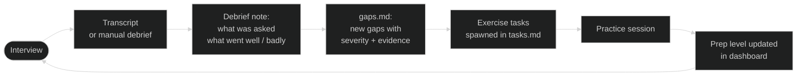
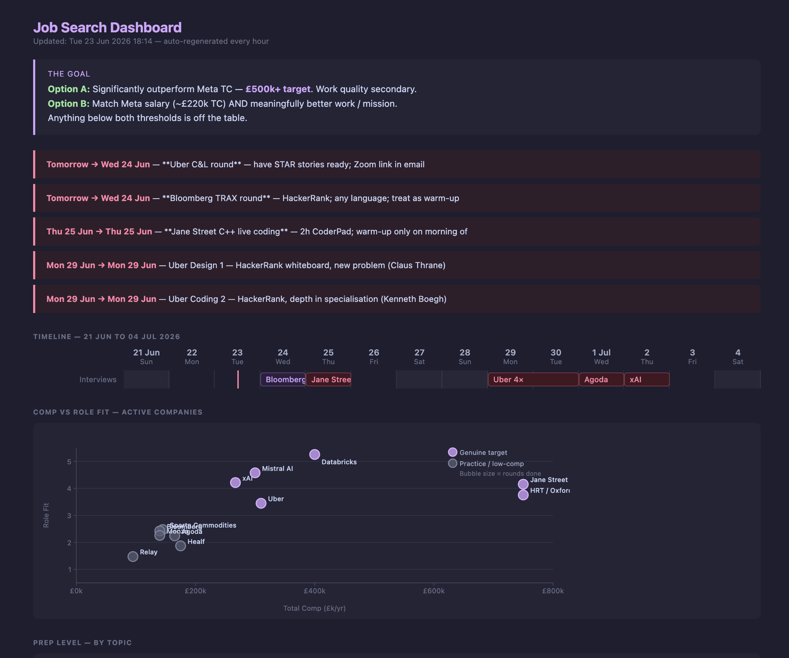
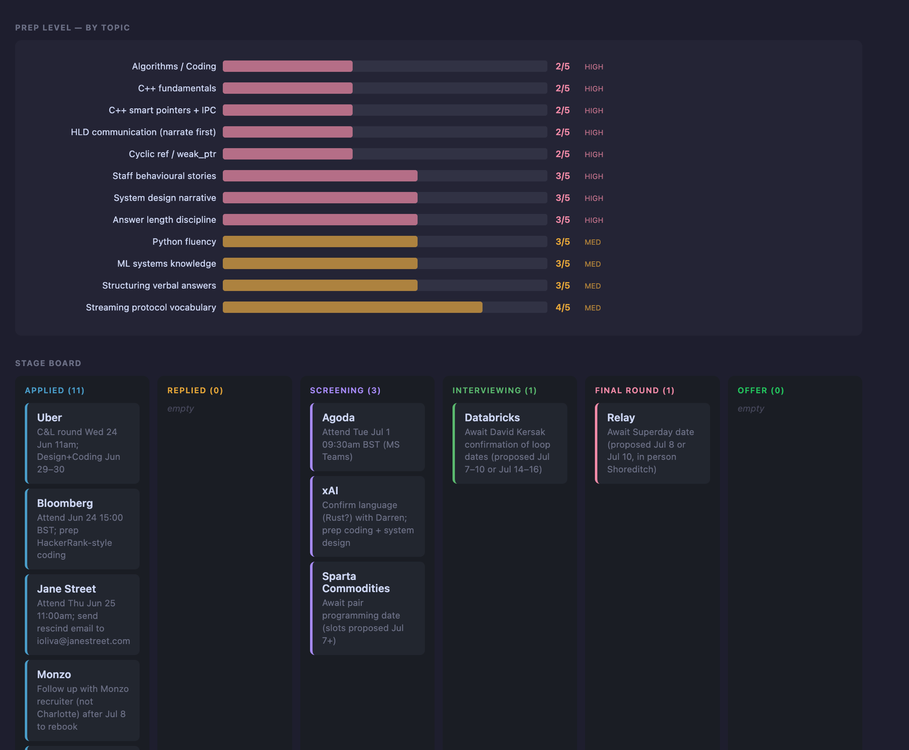

# Job Copilot

An AI-assisted job search framework built for senior engineers. Seed it with target companies, and it handles outreach, tracking, follow-up, and dashboarding — so you spend your time preparing for interviews, not managing a spreadsheet.

---

## How it works

There are two loops. The outreach loop fills your pipeline. The prep loop raises your interview bar.

**Outreach loop**


**Prep loop — what makes this different from a spreadsheet**



Every interview feeds back into preparation for the next one. The dashboard shows where you are on each topic — not just where you are in each pipeline.

## What this is

Job searching at senior/staff level is a full-time job: tracking 20+ companies, writing personalised outreach, following up at the right time, keeping notes on every conversation, figuring out which gaps you revealed in the last round. This project automates the mechanical parts using AI so you can focus on the parts that actually matter — preparation and conversation.

**The outreach loop:**

```
You add a target company
  → Copilot finds the right contact and drafts an outreach email
  → You review and send (one command)
  → Pipeline tracker updates automatically
  → Follow-up is flagged if no reply after N days
  → Dashboard shows your full pipeline at a glance
```

**The prep loop (runs in parallel):**

```
Interview ends
  → Drop transcript into transcripts/ (or debrief manually)
  → Debrief note created: questions asked, what landed, what didn't
  → gaps.md updated: new gap + severity + evidence from that specific call
  → Exercise tasks spawned in tasks.md: one concrete fix per gap
  → Practice fills the gap
  → Prep level rises — visible in the dashboard chart
  → Next interview: same pattern, surfacing the next layer
```

---

## Dashboard preview

**[→ Live demo](https://ankitdixit.github.io/job-copilot/dashboard/demo.html)** — sample pipeline with fake data, no setup needed.





The dashboard auto-regenerates from your local files every hour. It shows:
- **Goal box** — your comp target and what you'll accept
- **14-day Gantt** — every interview bar, today marker, weekend shading
- **Comp vs role fit scatter** — which companies are genuine targets vs practice
- **Prep level chart** — readiness per topic (HIGH/MED severity, 1–5 scale), updated after each practice session
- **Stage board** — kanban: Applied → Screening → Interviewing → Final Round → Offer
- **Pipeline table** — every company, next action, date

## What's working today (v0.1)

| Feature | Status | Details |
|---------|--------|---------|
| Browser agent | ✅ | Navigates any careers page, finds contacts, extracts job details |
| Gmail outreach | ✅ | Sends via your Gmail account (OAuth2, no password stored) |
| Pipeline tracker | ✅ | `pipeline.md` — one row per company, plain markdown |
| Health monitoring | ✅ | Checks Gmail token validity and automation health every 2h |
| Dashboard | ✅ | HTML file, opens locally — visual pipeline by stage |
| Background automation | ✅ | LaunchAgent (macOS) / systemd (Linux) for periodic checks |
| Interview debrief | ✅ | Reads meeting transcripts, creates structured debrief notes, updates pipeline |
| Prep notes + cheat sheets | ✅ | Per-company prep folders, topic cheat sheets, gap tracker |

## Planned

| Feature | Target |
|---------|--------|
| Auto job discovery | v0.2 — periodic scan of target company career pages |
| Follow-up automation | v0.2 — flag stale outreach, draft follow-ups |
| Standalone prep module | v0.3 — extract from Obsidian vault into portable format |
| Cloud deployment | v0.3 — Dockerfile + setup guide, run on a €4/mo VPS |
| Application assist | v0.3 — navigate to job application, hand off to Simplify/autofill |

---

## Architecture

```
job-copilot/
├── agents/
│   └── browser_agent.py     # AI browser automation (browser-use + local/cloud LLM)
├── tools/
│   ├── send_email.py        # Gmail API sender (OAuth2)
│   └── health_check.py      # Monitors token validity and automation health
├── dashboard/
│   └── index.html           # Visual pipeline dashboard (open as local file)
├── automation/
│   ├── com.jobcopilot.health.plist   # macOS LaunchAgent (runs health_check every 2h)
│   └── job-copilot-health.service   # Linux systemd service
├── pipeline.md              # Your opportunity tracker (edit this directly)
├── requirements.txt
└── setup.sh                 # One-command setup
```

**LLM layer:** The browser agent works with any OpenAI-compatible endpoint. Run it with a local model (LM Studio, Ollama) for zero ongoing cost, or point it at OpenAI/Anthropic for speed and accuracy. Qwen3 27B works well locally for navigation tasks.

**Email layer:** OAuth2 via Gmail API. Credentials stay on your machine, never in the repo. The send script requires you to see and approve the full draft before anything goes out.

**Pipeline layer:** Plain markdown. No database, no sync, no lock-in. `pipeline.md` is the source of truth — edit it directly, or let the scripts update it.

---

## Quickstart

### 1. Clone and install

```bash
git clone https://github.com/ankitdixit/job-copilot
cd job-copilot
python3 -m venv .venv && source .venv/bin/activate
pip install -r requirements.txt
playwright install chromium
```

### 2. Configure

Copy the example config and fill in your details:

```bash
cp .env.example .env
```

Edit `.env`:

```bash
# Your email address
GMAIL_USER=you@gmail.com

# LLM — local (LM Studio) or cloud (OpenAI)
LLM_BASE_URL=http://localhost:1234/v1
LLM_MODEL=qwen3-27b
LLM_API_KEY=lm-studio
```

### 3. Gmail setup (one-time)

You need a Google Cloud project to send email via Gmail API.

1. Go to [console.cloud.google.com](https://console.cloud.google.com)
2. Create a project → Enable **Gmail API**
3. Go to **Credentials** → **Create Credentials** → **OAuth 2.0 Client ID** → Desktop app
4. Download the JSON → save as `~/.config/job-copilot/credentials.json`
5. Run the auth flow once:
   ```bash
   python3 tools/send_email.py --to you@gmail.com --subject "test" --body "hello"
   ```
   A browser window opens → click Allow → token saved to `~/.config/job-copilot/token_send.json`

After this, email sending works silently from the command line.

### 4. Set up background monitoring (optional)

**macOS:**
```bash
cp automation/com.jobcopilot.health.plist ~/Library/LaunchAgents/
sed -i '' "s|/path/to/job-copilot|$(pwd)|g" ~/Library/LaunchAgents/com.jobcopilot.health.plist
launchctl load ~/Library/LaunchAgents/com.jobcopilot.health.plist
```

**Linux (systemd):**
```bash
cp automation/job-copilot-health.service ~/.config/systemd/user/
sed -i "s|/path/to/job-copilot|$(pwd)|g" ~/.config/systemd/user/job-copilot-health.service
systemctl --user enable --now job-copilot-health.service
```

---

## Usage

### Find open roles at a target company

```bash
source .venv/bin/activate
python3 agents/browser_agent.py "go to mistral.ai/careers and list all open engineering roles with titles and links"
```

### Draft and send outreach

Always review before sending. Never sends automatically.

```bash
# Draft your email in a file
cat > /tmp/outreach.txt << 'EOF'
Hi [Name],

I came across [Company] and was impressed by [specific thing].
I'm a Staff Engineer with a background in [X, Y, Z] and I'm exploring
opportunities in AI infrastructure. Would you have 20 minutes for a
quick call?

[Your name]
EOF

# Preview and send
python3 tools/send_email.py \
  --to name@company.com \
  --subject "Staff Engineer — interested in [Company]" \
  --body-file /tmp/outreach.txt
```

### Reply in an existing Gmail thread

Pass `--thread-id` and `--in-reply-to` to place the reply inside an existing conversation (so it threads correctly in Gmail rather than starting a new one). Get both IDs from the Gmail API or from `mcp__gmail get_thread` output.

```bash
python3 tools/send_email.py \
  --to name@company.com \
  --subject "Re: Staff Engineer — interested in [Company]" \
  --body-file /tmp/followup.txt \
  --thread-id <gmail-thread-id> \
  --in-reply-to <gmail-message-id>
```

| Flag | Description |
|------|-------------|
| `--thread-id` | Gmail thread ID — places the message inside an existing thread |
| `--in-reply-to` | Gmail message ID of the message being replied to (sets `In-Reply-To` / `References` headers) |

**Optional footer:** Set `EMAIL_FOOTER` in your `.env` to append a fixed line to every outbound email (e.g. a P.S. or a note about your availability). Leave it empty (the default) to send with no footer.

### View dashboard

Open `dashboard/index.html` in your browser. It reads from `pipeline.md` and shows stage, last action, and days since contact for each company.

### Update your pipeline

Edit `pipeline.md` directly after each action. Columns: Company, Role, Stage, Next Action, Contact, Date Added.

---

## LLM options

| Setup | Cost | Speed | Best for |
|-------|------|-------|---------|
| LM Studio + Qwen3 27B | Free | ~2 min/task | Local, private, no API cost |
| LM Studio + smaller model (7B) | Free | ~30s/task | Faster, less accurate |
| OpenAI GPT-4o | ~$0.01–0.10/task | ~5s/task | Best accuracy, cloud |
| Anthropic Claude | ~$0.01–0.10/task | ~5s/task | Best reasoning, cloud |

To use a cloud provider, set in `.env`:
```bash
LLM_BASE_URL=https://api.openai.com/v1
LLM_MODEL=gpt-4o
LLM_API_KEY=sk-your-key-here
```

---

## Interview prep integration

This is the part that separates Job Copilot from a tracker. Every interview generates signal about where your gaps are. The system captures that signal and turns it into preparation.

### The gap tracking loop

**Step 1 — Debrief after every interview**

Drop the transcript into `transcripts/` (Snaply exports markdown directly; any recorder works). Then run:

```bash
# Reads transcript, classifies the call, creates structured debrief
ingest-meeting
```

Or debrief manually if no transcript:

```bash
interview-debrief
```

The debrief note captures: questions asked (verbatim where possible), what landed, what didn't, gaps surfaced with evidence.

**Step 2 — Gap extraction**

Every gap surfaced in a debrief gets added to `gaps.md` with:
- **What**: the specific skill or behaviour that failed
- **Severity**: HIGH (blocks offers at target level) or MED (weakens performance)
- **Evidence**: the specific moment from the call — e.g. "couldn't enumerate IPC primitives; interviewer had to guide to pipes and sockets"
- **Fix plan**: one concrete practice action

Example entry auto-added after a C++ screen:
```
| C++ smart pointers vocab | HIGH | xAI screen: described concept without terms; missed cyclic ref | Study shared_ptr mechanics, weak_ptr for cycles; practice 60s cold explanation | open |
```

**Step 3 — Exercise tasks**

Each new gap spawns a task in `tasks.md`:
```
- [ ] (P1) [est: 1h] [flexible] #jobsearch nail shared_ptr/weak_ptr/unique_ptr cold — 60s answer
```

**Step 4 — Track prep level**

After each practice session, update `PREP_LEVELS` in `vault_update.py`. The dashboard generates a bar chart showing readiness per topic (1=unknown → 5=fluent under pressure), sorted HIGH-severity gaps first.

```python
PREP_LEVELS = {
    'C++ smart pointers + IPC':   (2, 'HIGH'),  # ← update this after practice
    'Algorithms / Coding':        (3, 'HIGH'),
    'System design narrative':    (3, 'HIGH'),
    # ...
}
```

The chart makes the current weak spots impossible to ignore.

### Second Brain integration

The full system runs inside an Obsidian vault with:
- `pipeline.md` — company tracker
- `gaps.md` — skill gap backlog (grows after each debrief)
- `tasks.md` — prioritised action list (P1/P2/P3)
- `transcripts/` — auto-ingested meeting transcripts
- `debriefs/` — structured notes per interview round
- `plans/` — weekly plans anchored to interview dates

The vault auto-update script (`vault_update.py`) reads from all of these and regenerates `schedule.html` every 6h: a local dashboard showing the full picture — pipeline stages, prep level chart, Gantt timeline — without any cloud dependency.

Extracting this into a standalone module (no Obsidian required) is on the v0.3 roadmap.

## Design principles

- **Human in the loop on outreach** — the send script shows you the full draft (to, subject, body) and waits for explicit confirmation. No email goes out automatically.
- **Local-first** — works with local LLMs, no mandatory cloud API cost.
- **No lock-in** — pipeline is plain markdown, emails go through your own Gmail account.
- **Composable** — each script does one thing. Wire them together in whatever way fits your workflow.
- **Private by default** — credentials never leave your machine, nothing is sent to third parties except the LLM endpoint you configure.

---

## Contributing

Issues and PRs welcome. The highest-value contributions right now:

- **Cloud deployment** — Dockerfile + setup guide that gets someone running on a VPS in under 10 minutes
- **Job discovery** — script that takes a list of target companies and checks their careers pages for new roles
- **Follow-up logic** — scan pipeline.md for stale outreach and surface a draft follow-up

See [open issues](https://github.com/ankitdixit/job-copilot/issues) for the full roadmap.
